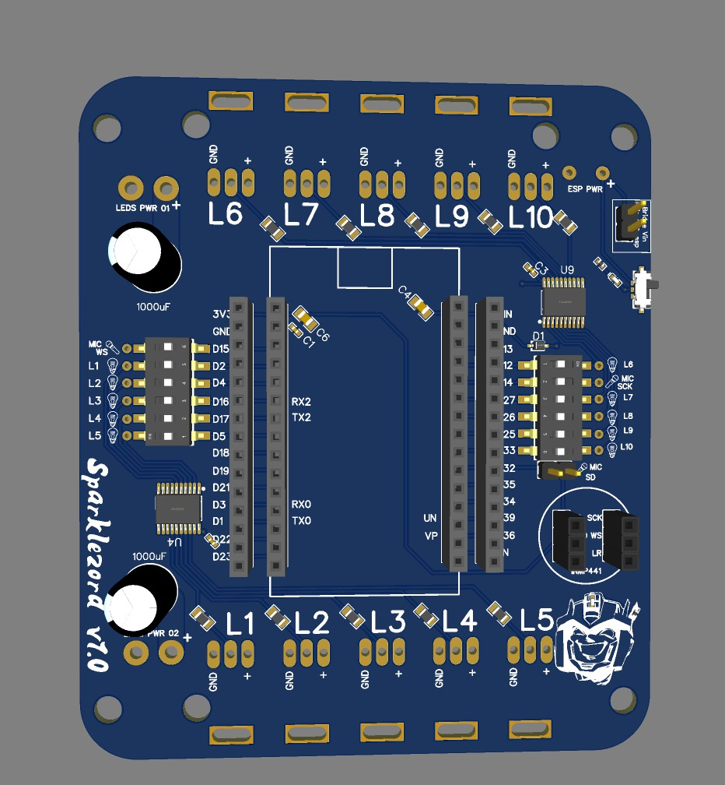
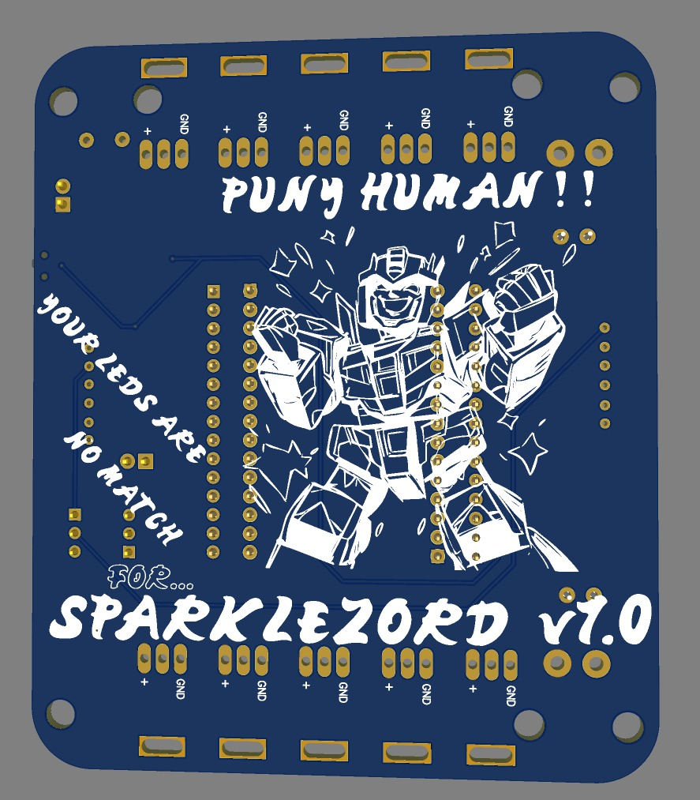

# Sparklezord PCB Board

A PCB design for Esp32 module (generic devkit 30p variant), to drive up to 10 addressable led strips with WLED.
 Also has headers for an IMNP441 digital mic, for sound reactive effects.

Made for Midburn projects and the burner community. ♥  If you make something cool with this, Let me know!

This repo contains:
* The Gerber file (defining the PCB circuitry)
* The BOM (parts list)
* The CPL ("pick'n'place" file for assembly)

With these 3 files, you should be able to order these from any major PCB fab.
The tutorial below shows [how to order from JLCPCB](#how-to-order), because what I'm familiar with

This is a medium-sized board - v1.0 of the module measures 85 x 100mm

# Default pins feature

## Using Default pins
The board comes with dip switches for all led and mic pins except MIC SD.
Make sure the dip switch is ON (lever pointing away from the esp32) to use the default pins.

## Overriding default pins
To wire your own pins, you can turn the dip switch off (towards the esp module) and solder a male dupont wire to the pad directly next to the dip switch.
then plug the dupont into the header for whatever pin you like.

## MIC SD Pin
To save costs, an extra pin (MIC SD - GPIO 32) does not use a dip switch, rather a simple male header.
To use the default pin, either use a jumper to connect the pins, or solder them directly

To override it, use a male-to-female dupont wire to jump the right pin (further from the esp) to whatever pin you like on the esp header.

# How to Order

First, locate the relevant files by version. For instance, [v1.0](./v1.0/) contains the BOM, Gerber, and pick'n'place file's you'll need.

## Main order - PCB

1. Go to [JLCPCB.com](https://jlcpcb.com/)
1. Create Account
1. Click Order Now in the top menu
1. Add Gerber file -> select the gerber zip
1. select the amount of boards you like (PCB Qty- 5/10/15 etc)
1. Most options should stay the same (2 layer board, 1 design, etc)
1. change the color if you like
1. Select PCB Assembly (assemble top side)
1. Click Next twice
1. Add BOM + CPL Files (CPL == "PickAndPlace")
1. Click Process BOM and CPL
1. Confirm BOM
1. Confirm placement
1. Product description - Category Other/Other, enter whatever ("leds board" etc)
1. Save to cart
1. Finalize order + shipping from cart
1. Make sure to select coupon on checkout (theres always something)

## Other components

## Esp32 Dev board

The Labyrinth board is designed to work with common [Esp32 30-pin development boards](https://www.aliexpress.com/item/32896618772.html?spm=a2g0o.order_list.order_list_main.17.81711802dsYyri)

Other boards will not work unless they're in the same form factor and have the same pinout.

## (Optional) Mic module

There are optional headers for an [IMNP441 mic module](https://www.aliexpress.com/item/4000045517597.html?spm).

## Connectors

You'll need to solder connectors for your leds to work. Generally JST-SM connectors are used (the 3-pin variant for the most popular WS2812 strips).
You can find these on AliExpress

## Capacitor

Optionally, you can one or two 1000uF electrolytic capacitors to the board to smooth out the led power supply a bit.

# Setup

## Installing WLED

(Tested on Windows)

1. Connect the Esp32 to your PC via USB
1. Go to [install.wled.me](http://install.wled.me)
1. Select a WLED version to install (if you want to use a microphone, make sure to pick a "Sound Reactive" version)
1. Press install
1. Select the relevant port (might say CH340 or CP2102 depending on the esp32's USB chip)
1. Hold the BOOT button on your Esp32 board
1. start the installation while holding the boot button
1. if it doesn't work, try again and hold the BOOT button somewhat earlier, or try releasing it a few secs after installation attempt starts.
1. Enter your WiFi credentials if you like

## Configure pins

Once WLED is working - connect to it (via APP or web interface), and go to settings to configure these pins:

NOTE: Make sure to follow the instructions on [Setting up default pins](#default-pins-feature), or these pins may not work!

### Led pins
1.  GPIO 2
2.  GPIO 4
3.  GPIO 16
4.  GPIO 17
5.  GPIO 5

6.  GPIO 12
7.  GPIO 27
8.  GPIO 26
9.  GPIO 25
10. GPIO 33

### Mic (Uses the defualt I2S Digital mic pins)
* SD  D32
* WS  D15
* SCK D14

(LR is hardwired to GND)

### Microphone pins

Set the mic mode to Digital (I2S), with these pins:

- SCK: GPIO 16
- SD: GPIO 4
- WS: GPIO 15

## Powering the board
There are two power inputs for the led Vin (power plane on bottom layer), and a separate power input for the Esp32.
These are conveniently spaced 5.08mm apart (200mil) which fits many screw terminals and some power connectors.

Hook up 5-6v to the Esp32 (on-board LDOs drop this to 3v3)

and usually 5v for leds as well (but check your specific brand of leds, some are 12v).
The LED indicator is made for 5v and may not light up properly if your leds are a different voltage.

There is also a diode to prevent the esp32 from powering the leds if bridged, which can fry USB ports if your esp is connected to serial on a PC.

Happend to a friend. Multiple times :)

### Bridging the Esp/led power input
If you'd like to bridge the power between the Esp32 and the leds, you can jump the two pins that read "bridge pwr" near the esp power input.

This can lead to less stable operation, as voltage dips from the leds compounded with noisy power supplies can cause brownouts on the esp32, possibly leading to freezes, resets and undefined behaviour.